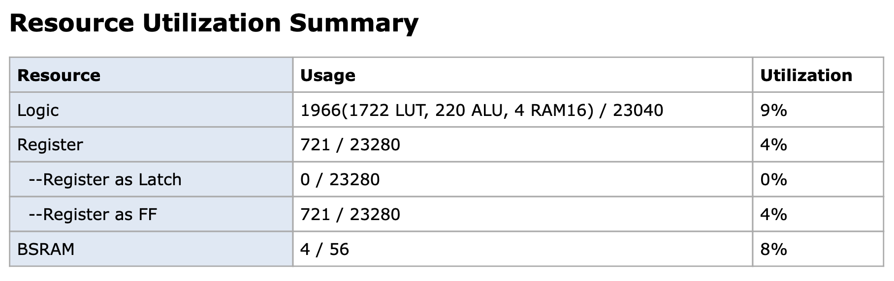
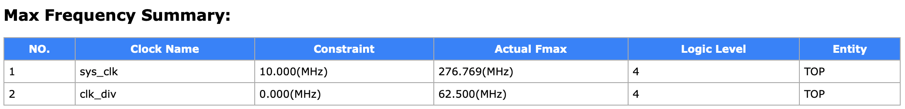

A compact, standards-clean RV32I core in SystemVerilog. The architecture is a modified Harvard design: distinct instruction and data paths for throughput, while sharing a single, flat memory map. The core is a straightforward, non-pipelined 4-stage state machine—FETCH / DECODE / READ / EXECUTE—that’s easy to reason about and extend. It synthesizes cleanly for Gowin GW5A FPGAs and has been verified end-to-end in hardware; timing analysis reports ~271 MHz fMAX.

  
   
  <em>Figure 1 — Synthesis summary</em>

  
   
  <em>Figure 2 — Timing analysis</em>

